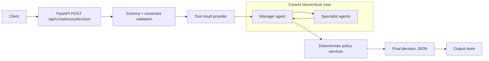
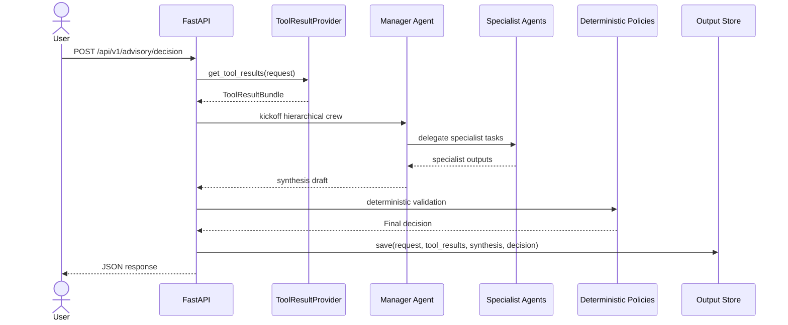

# Orca Agent Advisory - Technical Specification

## 1. Scope

This document describes the API contract, data model, decision pipeline, and auditability rules for the Orca Agent Advisory layer. It is aligned with the current Pydantic schemas and services in the codebase.

## 2. Architecture Overview



### Components

- API entrypoint: `app/main.py`
- Decision orchestration: `app/application/use_cases/advisory_decision_service.py`
- Specialist agent factories: `app/infrastructure/crewai/agents/*.py`
- Pure specialist analysis helpers: `app/application/specialists/*.py`
- Crew runner: `app/infrastructure/crewai/crew_runner.py`
- Deterministic policies: `app/application/services/*.py`, `app/application/decision/*.py`, `app/validators/*.py`
- Output persistence: `app/infrastructure/storage/output_store.py`

Execution mode note:

- Runtime uses the CrewAI manager path. The manager agent orchestrates specialist tasks in a hierarchical crew and returns a synthesis draft.
- Deterministic specialist/manager helpers are retained for tests and fallback-free validation fixtures, not production runtime branching.
- Set `CREWAI_VERBOSE=true` to stream CrewAI logs to the server console.

## 3. API Contract

Endpoint:

```
POST /api/v1/advisory/decision
```

### 3.1 Request: AdvisoryDecisionRequest

#### Top-level fields

| Field | Type | Meaning | Why it is needed |
| --- | --- | --- | --- |
| `request_id` | string | Unique request identifier | Correlation, auditing, and deterministic output storage |
| `timestamp` | datetime | Time when the request was created | Aligns decision timing and audit metadata |
| `as_of_timestamp` | datetime | Time that upstream data snapshots represent | Prevents use of future data and supports freshness checks |
| `user_query` | string | Natural language query | Provides user intent to the manager synthesis |
| `decision_mode` | enum | `single_symbol_advisory` or `portfolio_recommendation` | Selects the output schema and validation rules |
| `symbols` | list[string] | Symbols requested | Drives tool lookup and per-symbol validation |
| `user_context` | object | User constraints and preferences | Used for validation and decision adjustments |
| `metadata` | object | Optional context (client, locale, demo flags) | Supports tracing and demo wiring |

#### user_context fields

| Field | Type | Meaning | Why it is needed |
| --- | --- | --- | --- |
| `risk_tolerance` | enum | User risk tolerance | Risk caps, human review, and narrative framing |
| `investment_horizon` | enum | Time horizon | Conflict resolution and rationale weighting |
| `target_sectors` | list[string] | Preferred sectors | Future filtering and explainability |
| `excluded_symbols` | list[string] | Forbidden symbols | Enforces user constraints |
| `max_single_asset_weight` | float | Portfolio cap per asset | Portfolio validation rule |
| `allow_cash_position` | bool | Whether cash is allowed | Portfolio allocation behavior |
| `custom_constraints` | object | Arbitrary extra constraints | Extensible policy inputs |

#### Request validation rationale

- `single_symbol_advisory` requires exactly one symbol.
- `symbols` must be unique and non-empty.
- `as_of_timestamp` must not be later than `timestamp`.
- `excluded_symbols` cannot overlap with `symbols`.

### 3.2 Response: SingleSymbolDecision or PortfolioDecision

The API returns one of:

- `SingleSymbolDecision` (for `single_symbol_advisory`)
- `PortfolioDecision` (for `portfolio_recommendation`)
- `ErrorResponse` (validation or upstream errors)

#### Common base fields

| Field | Type | Meaning | Why it is needed |
| --- | --- | --- | --- |
| `request_id` | string | Echo request ID | Traceability |
| `run_id` | string | Unique run ID | Output file naming and audit correlation |
| `decision_mode` | enum | Response mode | Client routing and validation |
| `confidence` | float | Final confidence score | User-facing certainty |
| `confidence_breakdown` | object | Components of confidence | Transparent scoring |
| `requires_human_review` | bool | Human gate indicator | Safety and compliance workflow |
| `review_reasons` | list[enum] | Why review is required | Auditable rationale |
| `audit` | object | Model and data audit | Reproducibility |
| `retrieved_tool_audit` | object | Tool-level audit | Data lineage |
| `data_citations` | list[string] | Source references | Evidence grounding |
| `not_financial_advice` | true | Mandatory disclaimer | Compliance |

#### SingleSymbolDecision fields

| Field | Type | Meaning | Why it is needed |
| --- | --- | --- | --- |
| `symbol` | string | Symbol analyzed | Output identity |
| `recommendation` | enum | BUY/HOLD/SELL/WATCH | Decision output |
| `time_horizon` | enum | INTRADAY/SHORT/MEDIUM/LONG | Context of the decision |
| `summary` | string | Short explanation | Human-readable summary |
| `agent_outputs` | object | Specialist results | Explainability and traceability |
| `decision_rationale` | list | Factor-level explanations | Rationale transparency |
| `supporting_signals` | list[string] | Evidence supporting decision | Explanation |
| `conflicting_signals` | list[string] | Evidence in tension | Risk communication |
| `conflict_level` | enum | NONE/LOW/MEDIUM/HIGH | Human review triggers |
| `risk_warnings` | list[string] | Risk statements | Safety |
| `limitations` | list[string] | Data/model limits | Avoid over-claiming |
| `source_quality` | object | Data quality metrics | Confidence governance |

#### PortfolioDecision fields

| Field | Type | Meaning | Why it is needed |
| --- | --- | --- | --- |
| `risk_profile` | enum | User risk profile | Alignment check |
| `portfolio_allocation` | list | Allocation plan | Portfolio output |
| `portfolio_summary` | object | Portfolio overview | Quick scan for risk |
| `reasoning_trace` | list[string] | Narrative reasoning | Explainability |
| `validation_result` | object | Rule validation | Safety check |

#### ErrorResponse fields

| Field | Type | Meaning | Why it is needed |
| --- | --- | --- | --- |
| `request_id` | string | Echo request ID | Traceability |
| `status` | "ERROR" | Error marker | Client branching |
| `error_code` | string | Machine-readable error | Programmatic handling |
| `message` | string | Human-readable error | Debug and UX |
| `recoverable` | bool | Retry guidance | Client behavior |
| `missing_tool_results` | list[string] | Missing tool names | Data dependency errors |

## 4. Agent Outputs

### Base agent output

| Field | Type | Meaning | Why it is needed |
| --- | --- | --- | --- |
| `status` | enum | SUCCESS/SKIPPED/DEGRADED/ERROR | Execution status |
| `summary` | string | Short summary | Readable output |
| `confidence` | float | Agent confidence | Input to aggregation |
| `missing_fields` | list[string] | Missing expected fields | Debug and limitations |
| `limitations` | list[string] | Known limitations | Safety and transparency |
| `source_refs` | list[string] | Data provenance | Evidence grounding |

### Market data agent

- `market_signals`: list of per-symbol signals
- `ml_signal_available`: indicates ML signal presence

### Sentiment agent

- `sentiment_label` and `top_drivers`

### Valuation agent

- `valuation_label` and `valuation_drivers`

### Risk agent

- `risk_label`, `risk_factors`, and `confidence_cap`

## 5. Audit and Tool Lineage

### audit (AuditMetadata)

| Field | Meaning | Why it is needed |
| --- | --- | --- |
| `run_id` | Run identifier | Deterministic output and audit |
| `request_id` | Request identifier | Cross-link to input |
| `model_provider` | Provider name | Audit of LLM source |
| `model_name` | Model name | Reproducibility |
| `framework` | Orchestration framework | Traceability |
| `temperature` | LLM temperature | Reproducibility |
| `input_request_hash` | Hash of request | Integrity |
| `tool_result_bundle_hash` | Hash of tool results | Integrity |
| `validator_version` | Validator version | Policy tracking |
| `created_at` | Timestamp | Timeline alignment |

### retrieved_tool_audit

- `tool_calls`: per-tool status, source references, and hashes
- `tool_result_bundle_hash`: overall bundle hash

## 6. Confidence and Policy Services

Deterministic policy services control behavior regardless of LLM outputs:

- Source quality assessment: data freshness, relevance, and completeness
- Confidence aggregation: weighted signals + risk and quality caps
- Conflict resolution: adjusts recommendations in high-risk or low-quality scenarios
- Human review gate: flags low confidence or high risk outputs
- Financial validator: enforces disclaimers and portfolio constraints

## 7. Output Storage

Each decision run is saved to:

```
outputs/advisory_decisions/<run_id>.json
```

Saved payload includes:

- `request`
- `tool_results`
- `manager_synthesis`
- `final_decision`

This supports replay, auditing, and offline analysis.

## 8. Sequence Diagram



## 9. Decision Modes

- `single_symbol_advisory`: output is `SingleSymbolDecision`
- `portfolio_recommendation`: output is `PortfolioDecision`

The mode controls validation rules and expected tool results.

## 10. Extensibility Notes

Planned extensions (not yet in repo):

- Compliance guardrails service
- Critic/debate stage with feature flags
- Evaluation and demo reporting scripts

These are listed in the roadmap for future integration.
